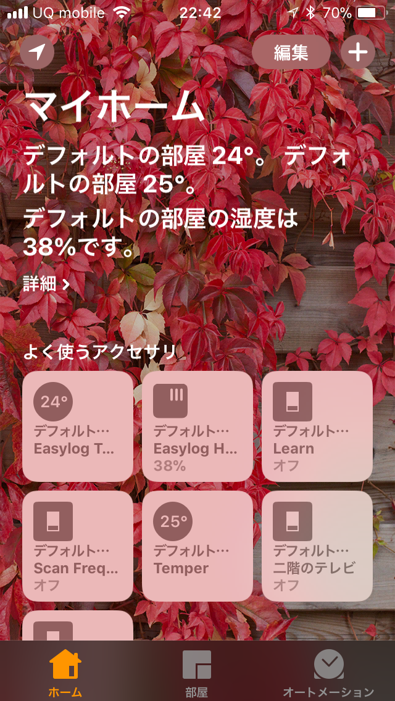

# Homebridge Temper(Easylog) Plugin

Homebridge経由でiOSのHomekitに、TemperとEasyLog(LASCAR L-USB-RT)の温度と湿度を表示できるプラグインです。

It is a plug-in that can display the temperature and humidity of Temper and EasyLog (LASCAR L-USB-RT) on iOS Homekit via Homebridge.

## Screen Shot



## Installation

Homebridgeにこのプラグインを追加する前に、TemperまたはEasyLogのCLIプログラムのコンパイルとインストールが必要です。

To Homebridge Before adding this plugin, you need to compile and install the Temper or EasyLog CLI program.

以下にTinkerBoard(TinkerOS,　Debianベース)のインストール方法を参考に記載します。

Refer to the installation method of TinkerBoard (TinkerOS, Debian Based) below by referring.

### TEMPer

以下にTinkerBoard(TinkerOS,　Debianベース)のインストール方法を参考に記載します。

#### Temper connection check

```sh
$ dmesg | grep TEMP
[395909.906434] usb 1-1.2: Product: TEMPerV1.4
[395909.961175] input: RDing TEMPerV1.4 as /devices/platform/ff540000.usb/usb1/1-1/1-1.2/1-1.2:1.0/0003:0C45:7401.0007/input/input5
[395910.023411] hid-generic 0003:0C45:7401.0007: input,hidraw4: USB HID v1.10 Keyboard [RDing TEMPerV1.4] on usb-ff540000.usb-1.2/input0
[395910.051423] hid-generic 0003:0C45:7401.0008: hiddev0,hidraw5: USB HID v1.10 Device [RDing TEMPerV1.4] on usb-ff540000.usb-1.2/input1
```

#### Install TEMPer required libraries

```sh
$ sudo apt-get install build-essential libusb-0.1-4 libusb-dev git
```

#### TEMPer make and install

```sh
$ mkdir TEMPer;cd TEMPer
$ git clone https://github.com/bitplane/temper.git
$ cd temper;cp temper.c temper.c.org;vi temper.c

$ diff temper.c.org temper.c
44c44
< utc = gmtime(&t);
---
> utc = localtime(&t);
47c47
< strftime(dt, 80, "%d-%b-%Y %H:%M", utc);
---
> strftime(dt, 80, "%Y-%m-%d %H:%M:%S", utc);

$ make
$ sudo mv temper /usr/local/bin/
$ sudo chmod u+s /usr/local/bin/temper
$ sudo temper
2018-01-13 12:13:35,23.260157
$ sudo temper
2018-01-13 15:18:16,24.160269
```

### EasyLog

#### EasyLog connection check

```sh
$ dmesg | grep LASCAR
[409224.992393] usb 1-1.4: Manufacturer: LASCAR LTD
[409225.007489] hid-generic 0003:1781:0EC4.0009: hiddev0,hidraw4: USB HID v1.10 Device [LASCAR LTD EL USB RT] on usb-ff540000.usb-1.4/input0
```

#### Install EasyLog required libraries

```sh
$ sudo apt-get install subversion automake libtool xsltproc docbook docbook-xsl xorg-docs doxygen libusb-0.1-4 libusb-dev 

```

#### Make and install EasyLog required library (libhid)

```sh
$ mkdir -p EasyLog/libhid;cd EasyLog/libhid
$ svn co svn://svn.debian.org/libhid/trunk libhid-trunk
$ cd libhid-trunk/
$ ./autogen.sh

# delete "-Werror".
$ vi Makefile
$ diff Makefile.org Makefile
267c267
< CFLAGS = -O2 -Wall -W -Werror
---
> CFLAGS = -O2 -Wall -W 

$ grep "Werror" ./*

$ cp Makefile Makefile.org;vi Makefile
$ diff Makefile.org Makefile
266c266
< CFLAGS = -O2 -Wall -W -Werror
---
> CFLAGS = -O2 -Wall -W

$ cp configure configure.org;vi configure
$ diff configure.org configure
13839,13840c13839,13840
<         CFLAGS="$CFLAGS -Werror"
<         CXXFLAGS="$CXXFLAGS -Werror"
---
>         CFLAGS="$CFLAGS"
>         CXXFLAGS="$CXXFLAGS"

$ cp libtool libtool.org;vi libtool
$ diff libtool.org libtool
167c167
< LTCFLAGS="-O2 -Wall -W -Werror"
---
> LTCFLAGS="-O2 -Wall -W"

$ cp config.status config.status.org;vi config.status
$ diff config.status.org config.status
603c603
< CFLAGS='-O2 -Wall -W -Werror'
---
> CFLAGS='-O2 -Wall -W'
905c905
< S["CFLAGS"]="-O2 -Wall -W -Werror"
---
> S["CFLAGS"]="-O2 -Wall -W"

# delete "--nonet"
$ cd doc/man
$ cp Makefile Makefile.org;vi Makefile
$ diff Makefile.org Makefile
327c327
< XP = xsltproc -''-nonet
---
> XP = xsltproc
$ cd ../..

# retry configure.
$ ./configure
$ make
$ sudo make install
$ sudo ldconfig
```

#### lascar-usb-thermometer make and install

```sh
$ git clone https://github.com/rca/lascar-usb-thermometer.git
$ cd lascar-usb-thermometer
$ make
$ sudo cp usb_termometer /usr/local/bin/
$ sudo chmod u+s /usr/local/bin/usb_termometer
$ sudo usb_termometer 
temp: 24.0, hum: 40.5
```

### Plugin install

```sh
$ npm install -g homebridge-temper
```

## Configuration

`config.json`の`platforms`に下記の様に追加してください。

Please add it to `platforms` of `config.json` as follows.

`accessories`の`type`は`temper`または`easylog`です、USBに接続している機器のみ記述してください。

`accessory` `type` is `temper` or`easylog`, please describe only the devices connected to USB.

`services`の`subType`は`accessories`の中で一意になる様にしてください。

Make matter `subType` of `services` unique within `accessories`.

```json
{
    "platforms": [
        {
            "platform": "TemperPlatform",
            "accessories": [
                {
                    "name": "Temper",
                    "type": "temper",
                    "services": [
                        {
                            "name": "Temper",
                            "subType": "bbb",
                            "type": "temp",
                            "command": "sudo",
                            "param": ["temper"]
                        }
                    ]
                },
                {
                    "name": "Easylog",
                    "type": "easylog",
                    "services": [
                        {
                            "name": "Easylog Temp",
                            "subType": "ccc",
                            "type": "temp",
                            "command": "sudo",
                            "param": ["usb_termometer"]
                        },
                        {
                            "name": "Easylog Hum",
                            "subType": "ddd",
                            "type": "hum",
                            "command": "sudo",
                            "param": ["usb_termometer"]
                        }
                    ]
                }
            ]
        }
    ]
}
```

## Contribution
Licenceに「Apache License Version 2.0」を選択しており、修正いただいた場合は「Pull Request」をお願いします。

"Apache License Version 2.0" has been selected for Licence and if you correct, please give "Pull Request".

1. Fork ([https://github.com/tcnksm/tool/fork](https://github.com/tcnksm/tool/fork))
2. Create a feature branch
3. Commit your changes
4. Rebase your local changes against the master branch
5. Run and Test
6. Create new Pull Request

## Licence
* [**Apache License Version 2.0, January 2004**](./LICENSE)

## Author
* [**@kght6123**](https://twitter.com/kght6123)

## Contacts

公開内容の詳細に関しては[**@kght6123**](https://twitter.com/kght6123)まで、お気軽にお問い合わせ下さい。

For more details on the public content please feel free to contact us at [**@kght6123**](https://twitter.com/kght6123).

## Copyright
**```Copyright (c) 2018 Hirotaka Koga```**
